**Advanced Lane Finding Project**

* The goal in this project is to write a software pipeline to identify the lane boundaries in a video
* A block diagram showing the flow of the project is displayed below

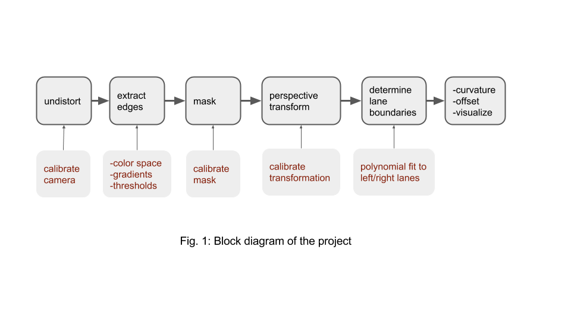

1. The undistort block applies distortion correction to the incoming raw image 
   * the camera calibration matrix and distortion coefficients needs to be calibrated
2. Extract hot pixels by using some combination of color space, possibly a form of gradient, thresholding  etc., to create a binary image
3. Determine and apply a mask to remove erroneous hot pixels 
4. Apply a perspective transform to rectify binary image ("birds-eye view"), in order to estimate curvature
5. Detect lane pixels by fitting a second order polynomial
6. Determine the curvature of the lane from polynomial and vehicle position with respect to center
   - output a visual display with lane boundaries & estimation of lane curvature and vehicle position

**Notes:** 

* most functions are defined in **cell-2** in IPython notebook
* the state class, that tracks radius and offset position, is defined in **cell-3** of IPython notebook
* global parameters are defined in **cell-4** of IPython notebook

## [Rubric](https://review.udacity.com/#!/rubrics/571/view) Points

### Camera Calibration

#### 1. Briefly state how you computed the camera matrix and distortion coefficients. Provide an example of a distortion corrected calibration image.

* The function **calibrate()**  calibrates the camera is in **cell-2** of the IPython notebook
* The procedure is similar to the one described in class and I will not repeat it here 
* This function returns the camera transformation matrix **mtx**, and the distortion coefficient vector **dist** 
* My code made calibration based on 17 out of 20 images provided
* Here are the 20 images, where the title of each image shows which ones were used for calibration

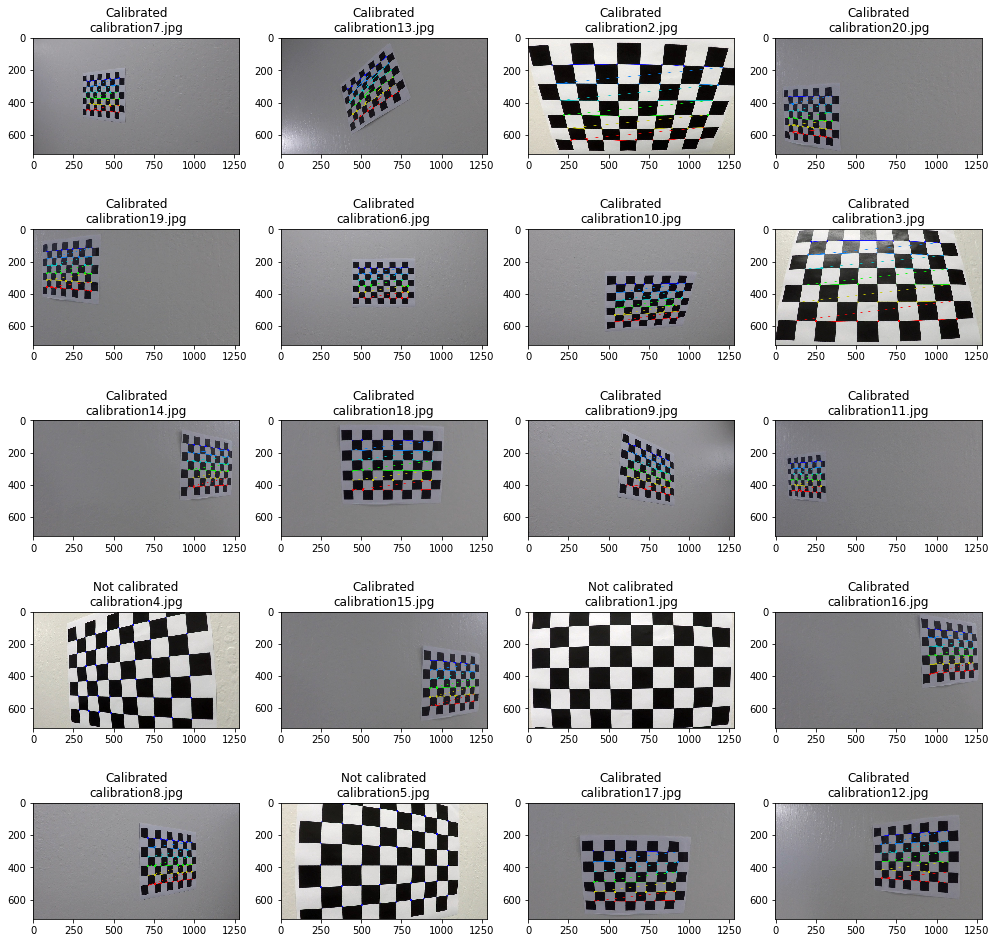

* Once **mtx** and **dist** were computed, I applied this distortion correction to a test image using the `cv2.undistort()` function and obtained this result below, also see **cell-6**

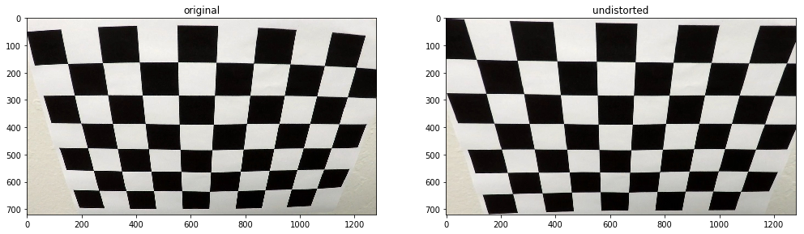

### Pipeline (single images)

#### 1. Provide an example of a distortion-corrected image.

I applied the distortion correction to all 8 images in directory "test_images". The 8 corrected images are shown below using the function **get_images()**, see **cell-7**

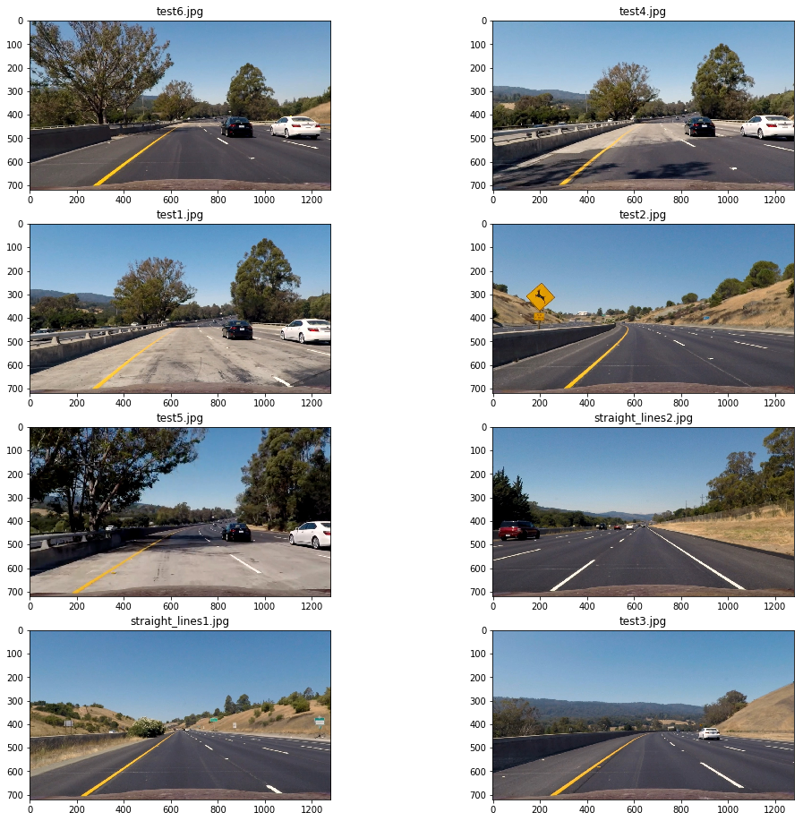

#### 2. Describe how (and identify where in your code) you used color transforms, gradients or other methods to create a thresholded binary image.  Provide an example of a binary image result.

* I found this portion of the project (the second block in Fig. 1) to be one of the most challenging parts of this project
  * the main reason is the vast space of options available to find hot pixels or the candidate edges (binary image)
* To demonstrate this search space,  figure (a) below, is the space I searched, where 2 binary images were obtained combined together. The two binary images had respectively two properties

* using a color space threshold
* using a color space feature followed by a gradient followed by a threshold

* Even within this limited search space that I considered, the options are very large 
  * 3 color space options considered (for each path)
  * 4 different different gradients 
  * significant threshold ranges
* I was hoping to introduce diversity in my estimates by combining two very different binary image derivation approaches
* The figure (b) on the right, is the architecture I ended up using 
  * the first binary image is derived from the **red** color thresholding (@190)  
  * the second binary image was obtained by taking the gradient of the **saturation** attribute, along the x-axis and with kernel size of 11,  and finally thresholding the output of gradient @20 
  * the two binary images were OR-ed together

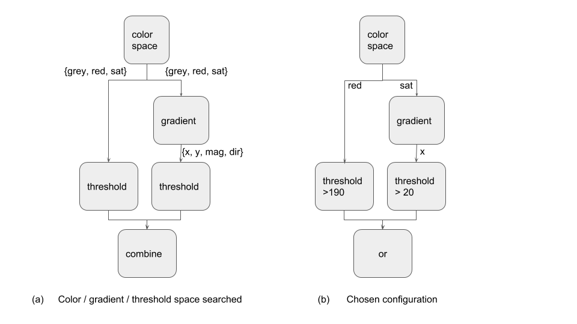

* To be able to investigate these options, I added the following functions:

  * **get_images()** inputs test images, & after undistoring, converts images to greyscale and HLS formats
  * **get_binary()** inputs an analog image, and threshold, it outputs a binary image using threshold
  * **get_grad_bin()** performs 4 different gradient functions (along x, along y, magnitude and direction). In addition it uses a kernel size and thresholds the output to a binary image 
  * **detect_edge()** implements the figure (b) above and is the function used in the pipeline 

* To minimize false-alarms, I applied a mask as we had used in project I. I reused the following two functions:

  * **get_vertices()** generates corner coordinates
  * **mask_image()** given an image, it returns the masked image

* As verification, **cell-9** applies the **red** color to a threshold set at 220 to all 8 images

  * the outcome is shown below

    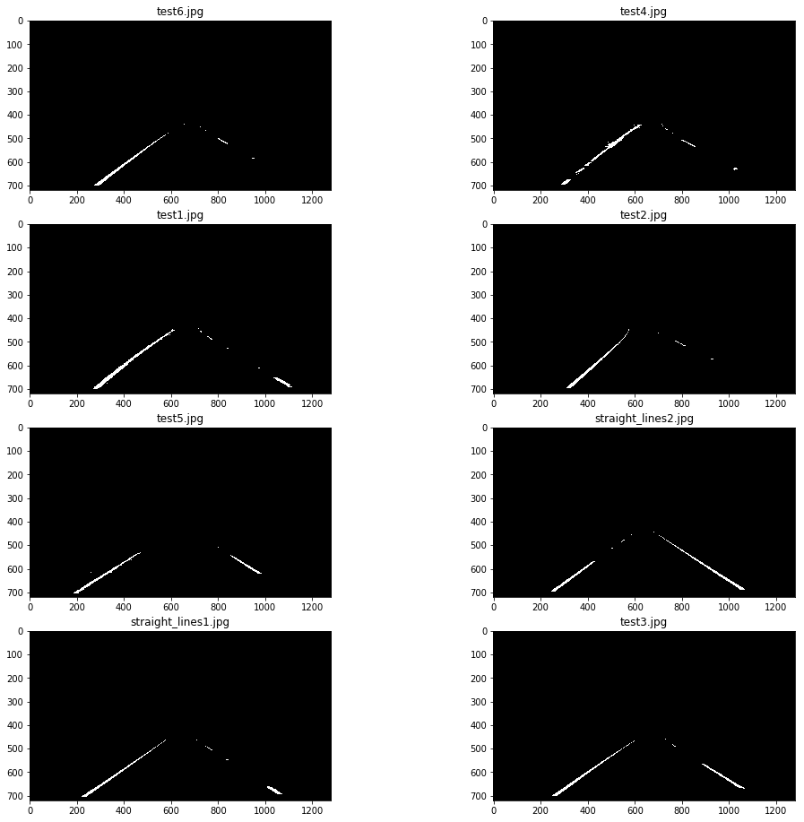

  * I want to note that using only this feature (RED @220), it was sufficient to process **project_video.mp4** successfully

  * the second feature, applying the gradient on saturation, was needed only for the challenge video

  * **cell-10** investigates thresholding on saturation alone 

  * **cell-11** investigates gradient applied to a gray image

  * **cell-12** investigates gradient applied to saturation

  * finally, **cell-13** is the chosen architecture of figure (b) above  (not the final threshold values though), and shown below

    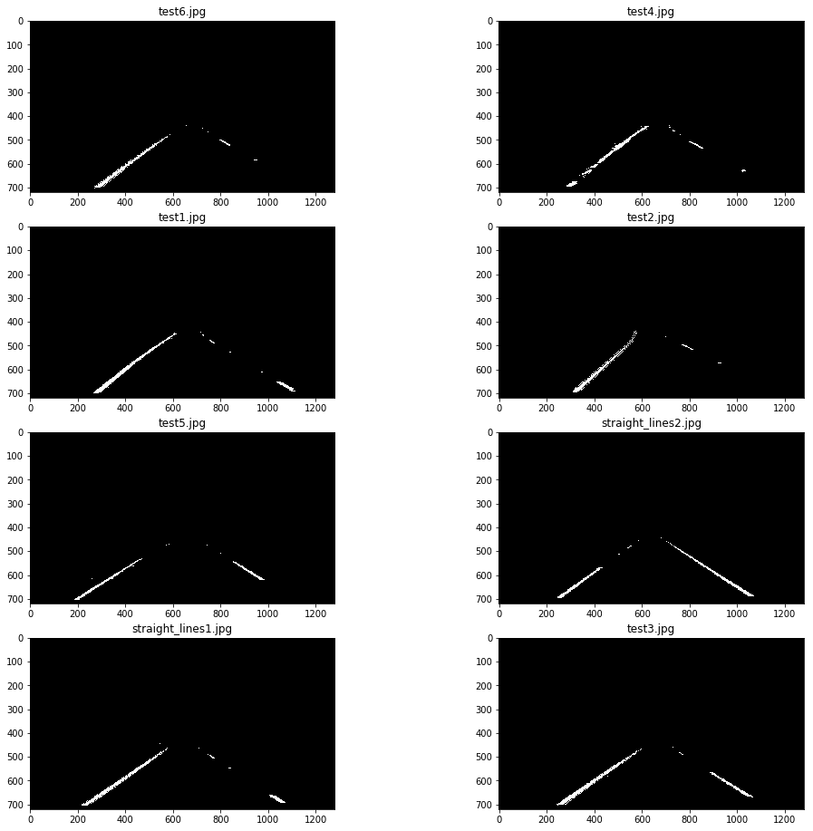

    ​

     

#### 3. Describe how (and identify where in your code) you performed a perspective transform and provide an example of a transformed image.

* the function that does perspective transformation is called **get_perspective_tx()** 

  * this function also computes the inverse transformation used to remap lane polynomials back to original image

* I tried 4 possible transformations applied on different test images and varying the starting coordinates

  * these 4 possibilities are passed as argument **option**

* I noted that the range of y impacts the transformation: 

  * I experimented the lower value of **y** to be 450, 475 and 500
  * I ended up choosing 475 (**option 2**)

* The four points chosen are shown below on the image, see also **cell-14**

  *  the four points on the lane are shown as 'x' and the desired transformed locations are shown as 'o'

  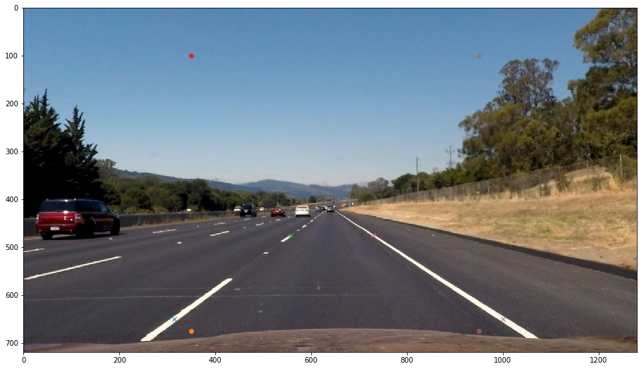

* The coordinates were as follows:

|  Source   | Destination |
| :-------: | :---------: |
| 315, 650  |  350, 675   |
| 557, 475  |  350, 100   |
| 1000, 650 |  950, 675   |
| 730, 475  |  950, 100   |

- I  experimented & verified with perspective transformation in **cell-15**, where the function was applied to all 8 test images, see below

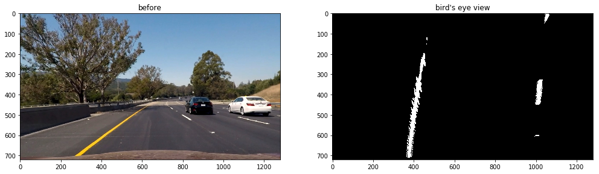

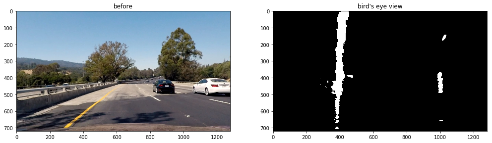

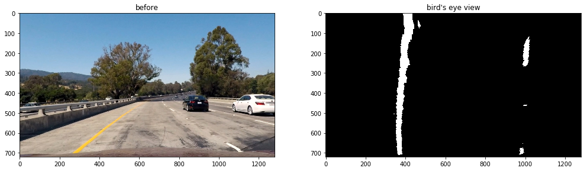

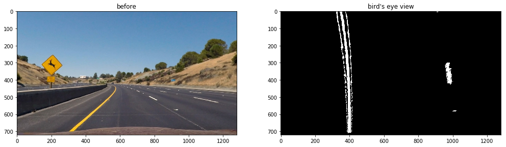

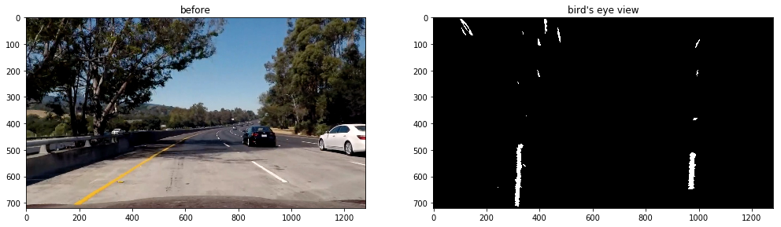

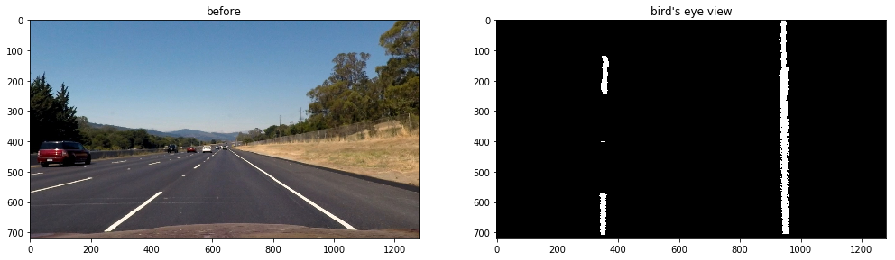

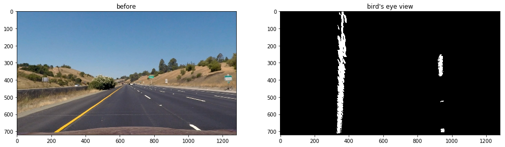

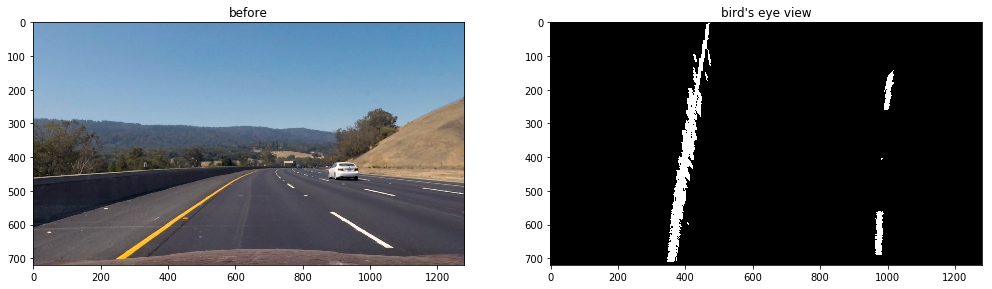

#### 4. Describe how (and identify where in your code) you identified lane-line pixels and fit their positions with a polynomial?

* I followed the methodology given in lectures closely and partitioned lane detection of frames into two:

  1. First frame, where a robust polynomial fit algorithm is applied 
  2. Rest of the frames, where the previous frame polynomials are used to accelerate determining the new polynomial

*  The above two functions are implemented as **get_poly_fit_1st_frame()** & **get_poly_fit()** respectively

  * **get_poly_fit_1st_frame()**, for first frame

    * This function first establishes base points for left and right lanes using histogram method described in lectures and executed in the function **get_base_points()**

    * Base points are verified in **cell-16** as shown below. The red circles are the base points and the right figures show the histogram associated with the base windows (right and left)

      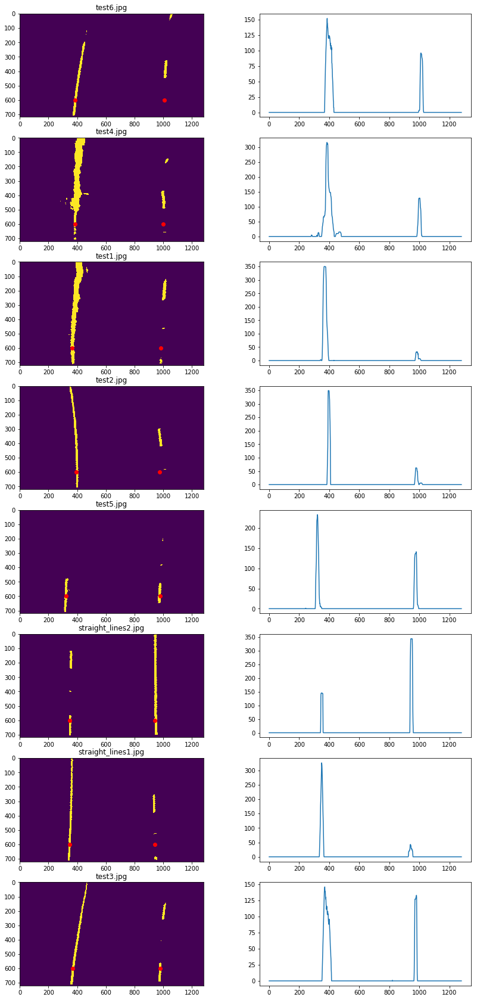

    * Once the base points are established the height of the image is partitioned into 9 windows as discussed in class and the first window center is chosen as the base coordinates (as long as there are enough points captured)

    * the next window is chosen based on the mean of the points captured in the previous window 

    * This is verified in **cell-17** as shown below

      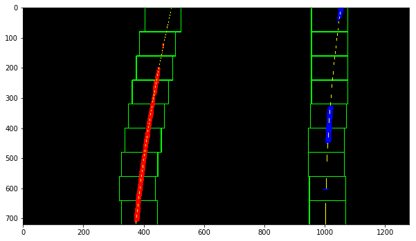

  * **get_poly_fit()**, for the rest of frames

    * the strategy here is to start with some initial polynomial and search for all the hot-pixel points within a margin of that polynomial 

    * from the hot-pixels, a new polynomial is fitted

    * this function is verified in **cell-18**, as shown below 

      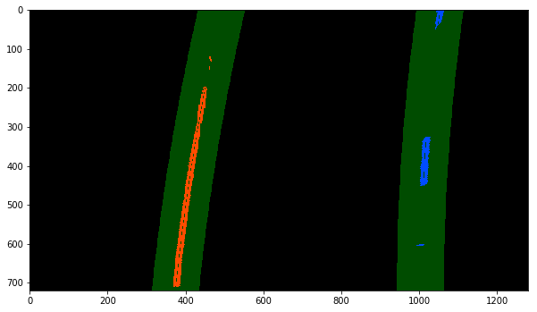 

#### 5. Describe how (and identify where in your code) you calculated the radius of curvature of the lane and the position of the vehicle with respect to center.

- The **radius** is determined by estimating the curvature of the polynomial which represents the road from **birds eye point of view**
- More specifically these are the steps taken to estimate the **radius**
  - get birds eye view of the image, as discussed earlier
  - get a second order polynomial fit of left/right lanes, as discussed earlier
  - given each (left & right) polynomial, use the formula used in class, to calculate the radius in units of pixels, see function  **get_radius()**, in **cell-2**, and method **state.get_radius()** in **cell-3**
  - the polynomial coefficients can be computed in units of meters, instead if pixels by introducing the following scales
    - Y_M_P        = 23/720      (meters per pixel in y-direction)                            
      X_M_P        = 3.7/700     (meters per pixel in x-direction)
    - I calibrated Y_M_L to make initial curvature of the video give roughly **1000 m radius**
  - given the 2 radii estimates, left & right, I took the average of the two as my estimates
    - I considered updating radius only if the 2 radii (l/r) were similar enough, however I was not very successful in this. I reverted back to just always taking the average
    - see method **state.get_radius()**
  - to smooth out the estimates, I wrote a class called **state**, see **cell-3**
    - I used a simple recursive low-pass filter with a single parameter $\alpha$ to smooth the polynomial coefficients from one frame to another
      - $p_{t+1} = \alpha p_t + (1-\alpha) p_{in}$
      - all 4 polynomials right/left & pixel/meter had their own filter with 4 different methods in state class
    - in addition I used another filter with parameter $\beta$ to additionally smooth out the radius, see method **state.update_radius()** method in **cell-3**
    - I ended up using $\alpha=\beta=0.9$
- The **position** or **the offset from center** was determined by comparing the center x-location of the image to the average of the left & right polynomials evaluated at largest y-value (Y_EVAL=719)  
  - similar to the radius, I smoothed the position by applying a low-pass filter with parameter $\beta$, after conversion to meters 

#### 6. Provide an example image of your result plotted back down onto the road such that the lane area is identified clearly.

- I wrote two pipelines, 

  - a regular **pipeline()**  in **cell-19**
  - a **pipeline_debug()** that is used for debugging with intermediate results, see **cell-20**

- I verified the pipeline in **cell-26** over all the 8 test images, see below

  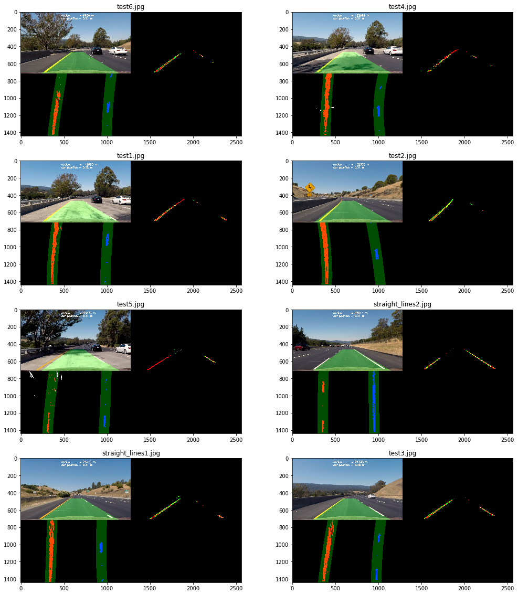

---

### Pipeline (video)

#### 1. Provide a link to your final video output.  Your pipeline should perform reasonably well on the entire project video (wobbly lines are ok but no catastrophic failures that would cause the car to drive off the road!).

- The video can be viewed in **cell-23** but also included as a separate file **P4_video_out.mp4**
- In addition, I am including a video for the **chalenge_video.mp4** in **cell-25** and separately, under the name  **P4_ch_video_out.mp4**

---

### Discussion

#### 1. Briefly discuss any problems / issues you faced in your implementation of this project.  Where will your pipeline likely fail?  What could you do to make it more robust?

- As mentioned earlier, deciding on the the color space, gradient or not and its type, and threshold settings was non trivial and time consuming
- In addition, spent significant amount of time trying to debug the video. Ended up using the **pipeline_debug()** function, and subclip() method to view multiple videos concurrently, seeing intermediate results
- Two cases where I had difficulty were:
  - sunny / bright spots
  - portions of the lanes of the freeway that were re-surfaced with newer asphalt (boundary that looks like lanes)
- I had to make three changes to get the challenge video running
  - lower thresholds, see next
  - tighten the margin around polynomial to reject noise
  - do less smoothing of low pass filter, i.e. reduce to $\alpha=0.9$ to allow polynomial adapt quicker if it got deviated due to noise
- I had to lower the threshold of red space from 220 to 190. Similarly reduced the saturation threshold from 80 to 20
  - this allowed me not to miss lanes at the expense of noisier data
  - as a result had to tighten the margins discussed above
  - It seems like different threshold values work better on different clips
    - it is difficult to find universal thresholds 

- For future study, I would
  - revisit the edge detection, including color space, gradients and threshold tuning
  - I would also improve the class to reject low reliability estimates and to better reuse earlier estimates
